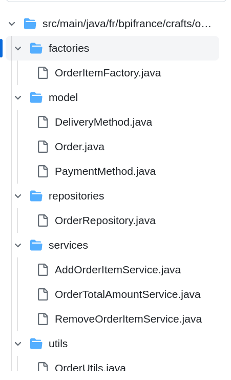
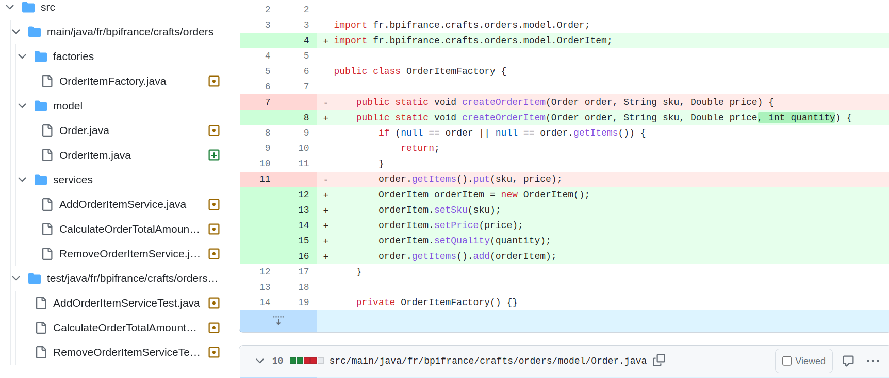
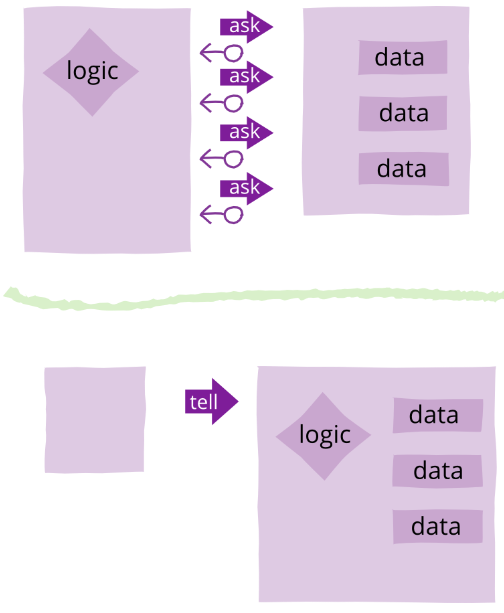
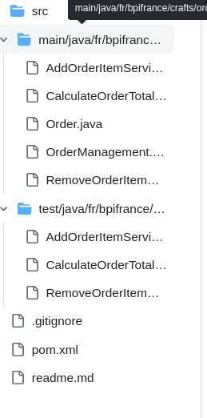
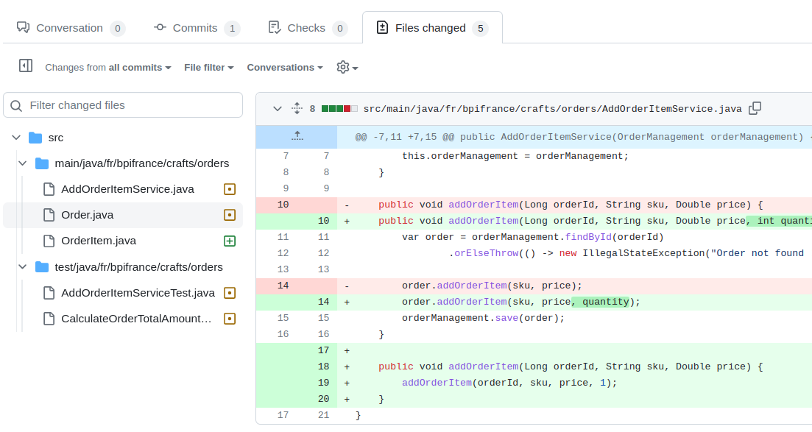

# Rich domain model

What is Rich domain ? 

Let's define first what is the opposite of rich domain

## Anemic Domain Model

### Looks like a real domain object

  - Named after the nouns of the domain (order, payment, billing, project..)
  - Are connected to a rich relationships (deliveryMethods, products, paymentMethods...)
  - They are no business rules implemented inside
  - Bag of setters and getters 
  
https://github.com/zakariabpifrance/rich-domain-orders/blob/934c0a1b65878a999df2db0fc8a95568dae622ca/src/main/java/fr/bpifrance/crafts/orders/model/Order.java#L5-L49

### Where the business logic ?

  - Set of services that captures all data an apply all the business logic.

https://github.com/zakariabpifrance/rich-domain-orders/blob/934c0a1b65878a999df2db0fc8a95568dae622ca/src/main/java/fr/bpifrance/crafts/orders/services/AddOrderItemService.java#L13-L19

https://github.com/zakariabpifrance/rich-domain-orders/blob/934c0a1b65878a999df2db0fc8a95568dae622ca/src/main/java/fr/bpifrance/crafts/orders/services/OrderTotalAmountService.java#L14-L23

https://github.com/zakariabpifrance/rich-domain-orders/blob/934c0a1b65878a999df2db0fc8a95568dae622ca/src/main/java/fr/bpifrance/crafts/orders/services/RemoveOrderItemService.java#L13-L25

  - Utilities, factories, mapper classes that share logic between multiple layers ([DRY](https://almostengineer.medium.com/dry-principle-of-software-development-common-mistake-15510cfea53e]))

https://github.com/zakariabpifrance/rich-domain-orders/blob/934c0a1b65878a999df2db0fc8a95568dae622ca/src/main/java/fr/bpifrance/crafts/orders/utils/OrderUtils.java#L7-L12

https://github.com/zakariabpifrance/rich-domain-orders/blob/934c0a1b65878a999df2db0fc8a95568dae622ca/src/main/java/fr/bpifrance/crafts/orders/factories/OrderItemFactory.java#L7-L12

#### Structure of packages



### Why this is an Anti-pattern ?

  - Procedural programming, manipulate data and share them between objects
  - Contrary of the basic idea of OOP
    - Combine data and behaviors
    - Breaks encapsulation
      - Object state are exposed
      - Getters/Setters
  - Coupling and Low cohesion

### Example of a new feature: user can choose the quantity of order items

- https://github.com/zakariabpifrance/rich-domain-orders/pull/1/files
- 
- Most of the business services are impacted

### Why this is a common practice ?

  - Some technologies encourage it
    - ORMs
    - Lombook
    - Mapstruct
    - Serialization tools (Jackson, Gson...)
    > Don’t marry the framework. Robert C. Martin
  - Some books and academic articles

## Rich Domain Model

### A real object
- Respect OOP and Encapsulation
- Implement behaviours
- High cohesion & low coupling
  https://github.com/zakariabpifrance/rich-domain-orders/blob/31ab22d28b00b4ed286c8e508ee31f07fb4e489b/src/main/java/fr/bpifrance/crafts/orders/Order.java#L5-L56

### How to create a rich domain object ?

#### [Tell don't ask](https://martinfowler.com/bliki/TellDontAsk.html)


> **`Don't do that`**

https://github.com/zakariabpifrance/rich-domain-orders/blob/934c0a1b65878a999df2db0fc8a95568dae622ca/src/main/java/fr/bpifrance/crafts/orders/services/OrderTotalAmountService.java#L14-L23

> **`Do :`**
https://github.com/zakariabpifrance/rich-domain-orders/blob/31ab22d28b00b4ed286c8e508ee31f07fb4e489b/src/main/java/fr/bpifrance/crafts/orders/Order.java#L27-L33


#### [Demeter Law](https://betterprogramming.pub/demeters-law-don-t-talk-to-strangers-87bb4af11694)
> Don't talk to strangers

> Don't Chain Method calls - The pragmatic programmer (Andy Hunt & Dave Thomas)

```java
// `Don't do that`

import io.rich.domain.crafts.orders.OrderItem;

order.getItems().get("TSH-FFF-M).getPrice();

// Do

        
order.getItemPrice("TSH-FFF-M");
```
#### High cohesion & low coupling

- Avoid couple to frameworks
- Do not couple to implementation details, prefer declare contracts
- Solid
- Put things that change together in the same place
- Avoid multi layer technical packages
- Use package protected classes to hide implementation details
- Avoid setters. [Martin Fowler GetterEradicator](https://martinfowler.com/bliki/GetterEradicator.html)
- Do not generate getters until your have a good reason for that. [Allen Hollob's article](https://www.infoworld.com/article/2073723/why-getter-and-setter-methods-are-evil.html)

#### Structure of the package:



### Example of a new feature: user can choose the quantity of order items with rich object

- https://github.com/zakariabpifrance/rich-domain-orders/pull/4/files
- 
- Only **AddOrderItemService** are impacted.


