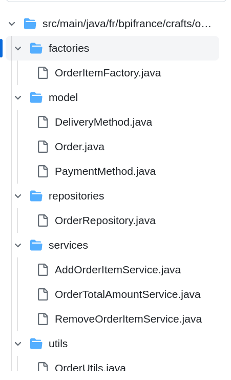

# Rich domain model

What is Rich domain ? 

Let's define first what is the opposite of rich domain

## Anaemic Domain Model

### Looks like a real domain object

  - Named after the nouns of the domain (order, payment, billing, project..)
  - Are connected to a rich relationships (deliveryMethods, products, paymentMethods...)
  - They are no business rules implemented inside
  - Bag of setters and getters 
  
https://github.com/zakariabpifrance/rich-domain-orders/blob/934c0a1b65878a999df2db0fc8a95568dae622ca/src/main/java/fr/bpifrance/crafts/orders/model/Order.java#L5-L49

### Where the business logic ?

  - Set of services that captures all data an apply all the business logic.

https://github.com/zakariabpifrance/rich-domain-orders/blob/934c0a1b65878a999df2db0fc8a95568dae622ca/src/main/java/fr/bpifrance/crafts/orders/services/AddOrderItemService.java#L13-L19

https://github.com/zakariabpifrance/rich-domain-orders/blob/934c0a1b65878a999df2db0fc8a95568dae622ca/src/main/java/fr/bpifrance/crafts/orders/services/OrderTotalAmountService.java#L14-L23

https://github.com/zakariabpifrance/rich-domain-orders/blob/934c0a1b65878a999df2db0fc8a95568dae622ca/src/main/java/fr/bpifrance/crafts/orders/services/RemoveOrderItemService.java#L13-L25

  - Utilities, factories, mapper classes that share logic between multiple services ([DRY](https://almostengineer.medium.com/dry-principle-of-software-development-common-mistake-15510cfea53e]))

https://github.com/zakariabpifrance/rich-domain-orders/blob/934c0a1b65878a999df2db0fc8a95568dae622ca/src/main/java/fr/bpifrance/crafts/orders/utils/OrderUtils.java#L7-L12

https://github.com/zakariabpifrance/rich-domain-orders/blob/934c0a1b65878a999df2db0fc8a95568dae622ca/src/main/java/fr/bpifrance/crafts/orders/factories/OrderItemFactory.java#L7-L12
  
  - Results

### Why this is an Anti-pattern ?

  - Procedural programming, manipulate data and share them between objects
  - Contrary of the basic idea of OOP
    - Combine data and behaviors
  - Breaks encapsulation
    - Object state are exposed
    - Getters/Setters
  - Coupling and Low cohesion

### Why this is a common practice ?

  - Some technologies encourage it
    - ORMs
    - Lombook
    - Mapstruct
    > Don’t marry the framework. Robert C. Martin
    - Some books and academic articles

  

